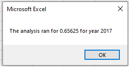
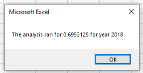
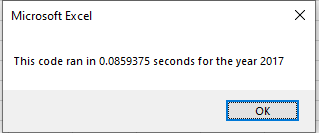
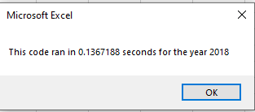
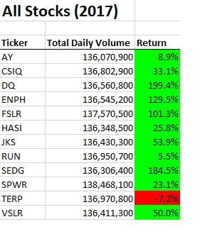
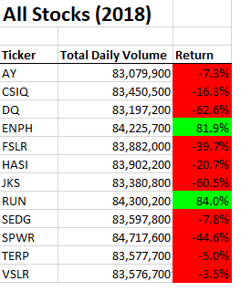

# Refactor VBA Code and Measure Performance

## Overview of Project
	Refactor the stock analysis module by making the code more efficient, run faster and easier to read.
	
	
## Result

Used the array to store the tickers, tickervolumes, starting price & ending price of the stock for the day. 
Initialized the arrays to stored the values in the array using loop. 
Created header and formatted the header in the All Stocks Analysis tab.
Using the loops wrote in the All Stocks Analysis tab the ticker name, volume of the stocks & the return.
Formatted the total daily volume column to number format with comma.
"Return" Column was formatted to red color if the return on stocks was negative & green color if the return on stocks was positive.

###	 Before Refractoring 
&nbsp;&nbsp;&nbsp;&nbsp;

###	After Refractoring 

###     Analysis Result
&nbsp;&nbsp;&nbsp;&nbsp; 
## Summary

### Advantage & Disadvantage of Refactoring Code
	 
Advantage of Refactoring:
  * To make the program run faster.
  * Make the program easier to read & debug.
  * Easier to make changes, maintain the module in future date.
    	 
Disadvantage of Refactoring:
  - We may underestimate the amount of time for refactoring.
  - if refactoring is done wrong, it will take more time debugging between different modules.
 		
	
### Advantage & Disadvantage of Refactoring Code for All-Stock Analysis
Advantage of Refactoring the code:
- the module ran faster than the original module.
- the code is more structured & easy to decode.
- The output was written to the All-Stock Analysis tab after all the calculations of the all the ticker.

Disadvantage of Refactoring the code:
- The output is stored in an array which takes up computer memory 
(even though negligible in this case).
- Since the data was not large, the running time before & after refactoring was different by .5 seconds!

 
